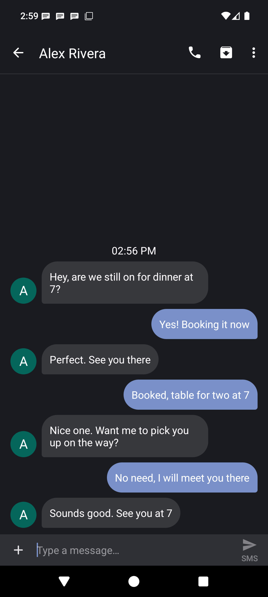

# Levinium Messages

**An SMS app that doesn't notify you about texts you are already reading.**

This is an unofficial fork of [Fossify Messages](https://github.com/FossifyOrg/Messages) with two
fixes: incoming messages stop raising notifications you would only have to dismiss, and a message
that arrives while you are at the bottom of a conversation actually scrolls into view.

It is not a Fossify product and is not affiliated with, endorsed by, or supported by the Fossify
project. Please report problems with this fork [here](https://github.com/levinium/Messages/issues)
rather than to them.

[](https://github.com/levinium/Messages/releases/latest)
[](https://github.com/levinium/Messages/releases)


## Download

[**LeviniumMessages-1.9.1.apk**](https://github.com/levinium/Messages/releases/latest) — 6.3 MB

Your browser or file manager will warn you before installing an app from outside an app store, and
Android will ask you to allow installs from that app once. That is expected for any APK installed by
hand.

To actually receive messages, set it as your default SMS app: **Settings → Apps → Default apps → SMS
app**. Your texts live in Android's system message store rather than inside the app, so switching
between messaging apps does not move or lose them.

It installs as its own app (`org.fossify.messages.levinium`) alongside Fossify Messages, so you can
try it without giving anything up. Releases are signed with a personal key, and Android will not
install an update signed with a different key over an existing install, so updates have to come from
this repo.

## Notifications are skipped for messages already on screen

Upstream posts a notification even when the message arrives in the conversation you currently have
open, so an active back-and-forth leaves one to dismiss for every reply.

A conversation only counts as showing the message when it is **scrolled to its end**. Scrolled up,
you still get a notification, because the message lands below the fold where it is easy to miss —
and scrolling down to it then dismisses that notification and marks it read.

The alert the notification would have played is **played in its place**, so nothing arrives
silently. It goes through the conversation's own notification channel and honors Do Not Disturb and
the ringer mode, so a muted conversation or a silenced phone stays quiet.

All of it is optional, under **Settings → Notifications**, defaulting to the behavior above. Turning
the first switch off restores upstream behavior for an open conversation completely.


## New messages scroll into view

Receiving a message while sitting at the bottom of a conversation used to leave it half cut off
below the fold, needing a manual scroll to read what had just arrived.

Two bugs sat in the same block upstream. The "is the user at the bottom" test required the last item
to be exactly one position below the last visible one, but when you really are at the bottom that
difference is zero, so the check failed in exactly the case it existed for. And when it did fire, it
scrolled to the last index of the *previous* list, which is the message before the one that arrived.



## Upstream

Both fixes are reported upstream, and if they land there this fork stops having a reason to exist:

- [FossifyOrg/Messages#877](https://github.com/FossifyOrg/Messages/issues/877) — notifications for
  messages you are already reading
- [FossifyOrg/Messages#878](https://github.com/FossifyOrg/Messages/issues/878) — new messages not
  scrolled into view

## Building from source

Requires JDK 17 or newer and the Android SDK (compileSdk 36).

```sh
./gradlew assembleFossDebug      # debug build, installs alongside as .debug
./gradlew assembleFossRelease    # release build; needs keystore.properties, see app/build.gradle.kts
```

Two things about this fork are deliberate and worth knowing before changing them. The Kotlin and
resource namespace stays `org.fossify.messages` so the sources remain diffable against upstream,
while the installed package id is `org.fossify.messages.levinium` — `SplashActivity` has to live
under the latter, because commons builds the launcher icon aliases from it. And that id keeps the
`org.fossify.` prefix on purpose: commons warns the user they are running "a fake version of the
app" whenever the package name lacks it.

## License

GPL-3.0, the same license as upstream — see [LICENSE](LICENSE).

This is a modified version of Fossify Messages. The original work is copyright the Fossify project
and its contributors; the modifications described above are copyright their respective authors. The
Fossify name, logo and branding belong to the Fossify project and are not used by this fork.
