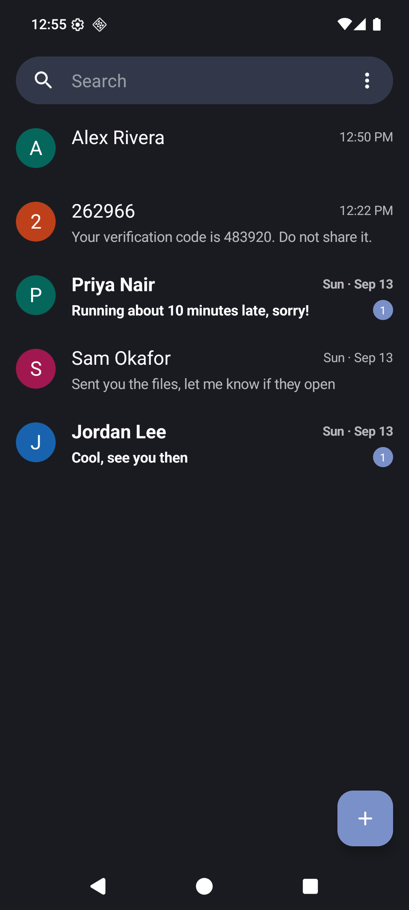
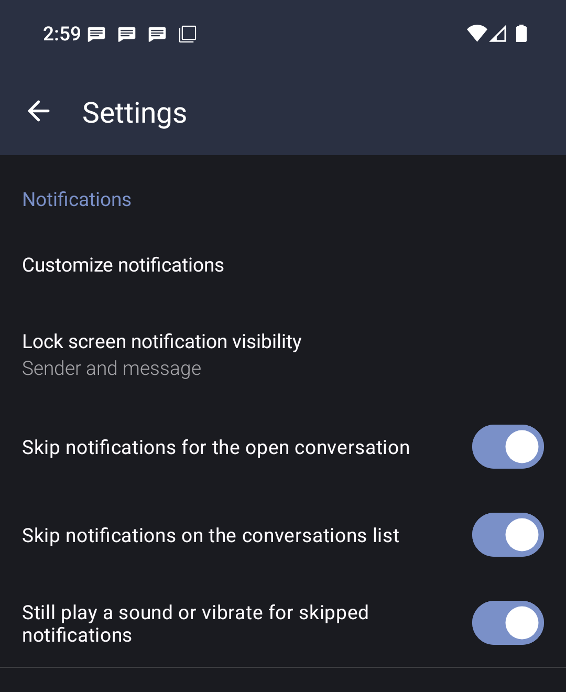
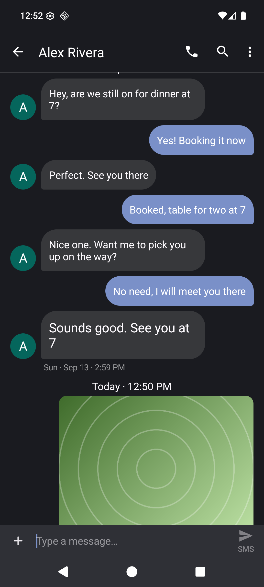
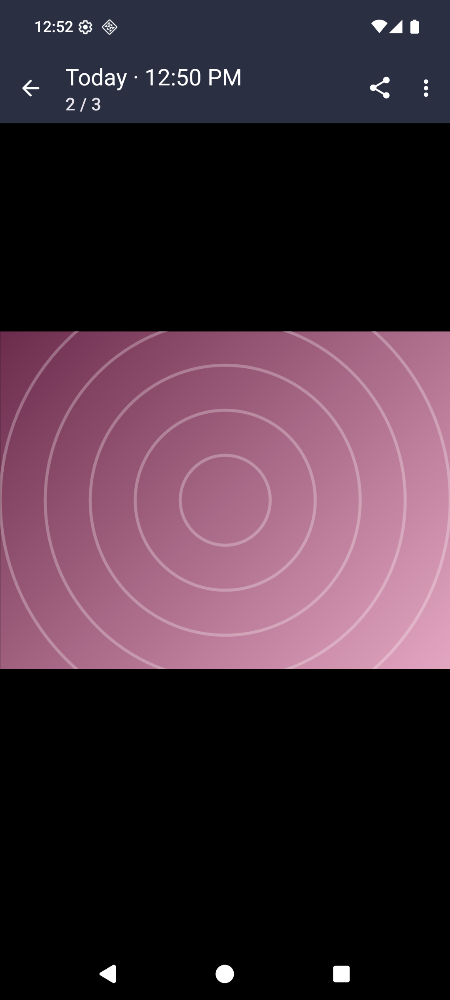
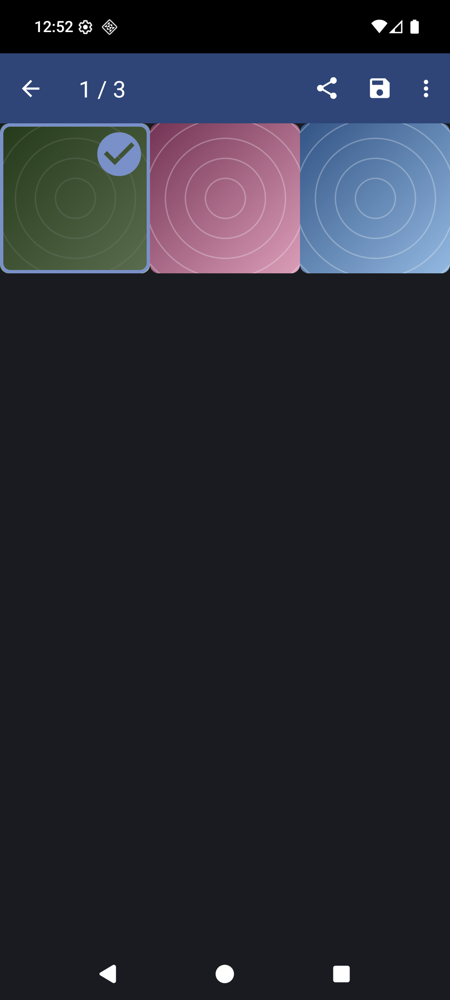
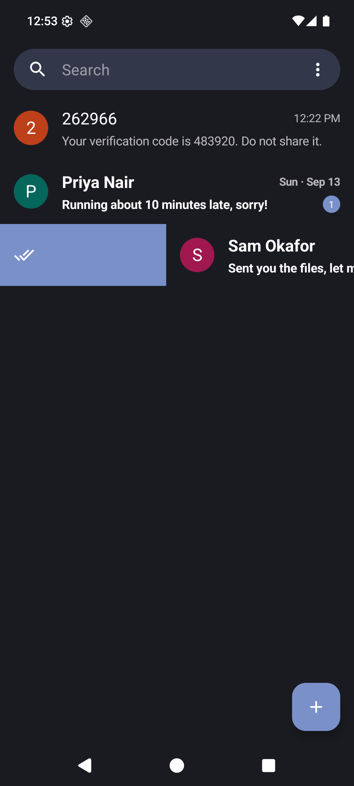
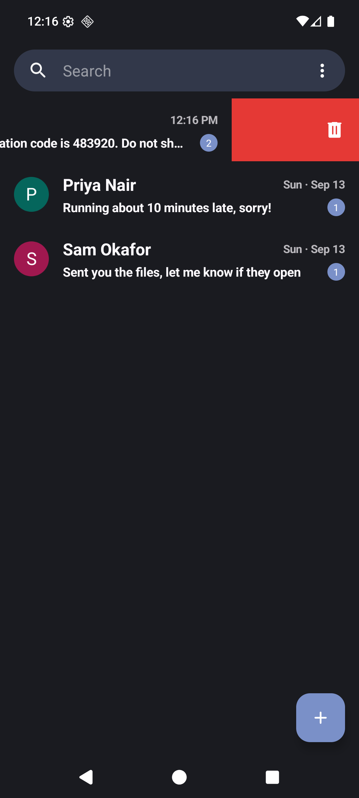
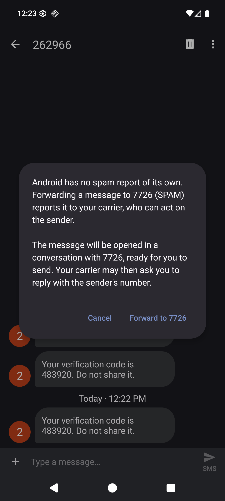
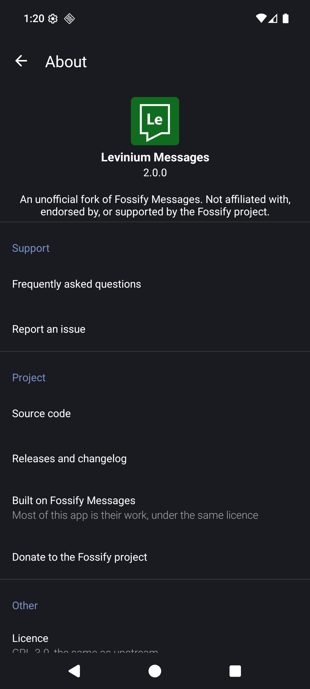
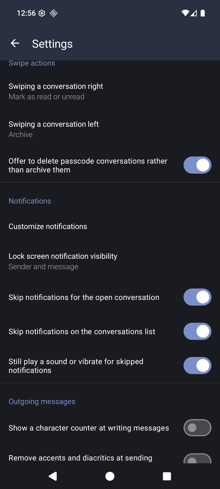

# Levinium Messages

**An SMS app that stays out of your way: no notifications for messages you are already reading, a
gallery for what a conversation has sent you, and dates you can read at a glance.**

An unofficial fork of [Fossify Messages](https://github.com/FossifyOrg/Messages), keeping everything
that app does and adding the things this one needed. It is not a Fossify product and is not
affiliated with, endorsed by, or supported by the Fossify project. Please report problems with this
fork [here](https://github.com/levinium/Messages/issues) rather than to them.

[](https://github.com/levinium/Messages/releases/latest)
[](https://github.com/levinium/Messages/releases)




## Download

[**LeviniumMessages-2.1.0.apk**](https://github.com/levinium/Messages/releases/latest) — 7.2 MB

Built on Fossify Messages 1.9.1.

Your browser or file manager will warn you before installing an app from outside an app store, and
Android will ask you to allow installs from that app once. That is expected for any APK installed by
hand.

To actually receive messages, set it as your default SMS app: **Settings → Apps → Default apps → SMS
app**. Your texts live in Android's system message store rather than inside the app, so switching
between messaging apps does not move or lose them.

It installs as its own app (`com.levinium.messages`) alongside Fossify Messages, so you can
try it without giving anything up. Releases are signed with a personal key, and Android will not
install an update signed with a different key over an existing install, so updates have to come from
this repo.

## Notifications are skipped for messages already on screen

Upstream posts a notification even when the message arrives in the conversation you currently have
open, so an active back-and-forth leaves one to dismiss for every reply.

A conversation only counts as showing the message when it is **scrolled to its end**. Scrolled up,
you still get a notification, because the message lands below the fold where it is easy to miss —
and scrolling down to it then dismisses that notification and marks it read.

The alert the notification would have played is **played in its place**, so nothing arrives
silently. It goes through the conversation's own notification channel and honors Do Not Disturb and
the ringer mode, so a muted conversation or a silenced phone stays quiet.

A message that arrives while you are sitting at the bottom of a conversation also **scrolls into
view** rather than landing half cut off below the fold.



## Dates you can read

`09/19` tells you nothing about which of the two numbers is the month. Dates read as a person would
say them — **Wed · Sep 19 · 8:03 PM** — throughout the app: on the separators inside a conversation,
in the list, under an opened message and in the gallery.

The year is dropped while it is still the current one, and today and yesterday are named rather than
dated. Both of those, and the spelled-out format itself, can be turned off in Settings.

## Tap a message to read it

Tapping a message opens it: larger text, its timestamp underneath, and the text selectable so you
can copy part of it rather than the whole thing. Tapping it again closes it.

Long pressing a link offers to copy, open or share it. Messages that are nothing but emoji are drawn
large, the way every other messaging app draws them.



## Pictures stay in the app

Tapping a picture used to hand it to whatever other app claimed the file type, which loses the
conversation you were in. It opens in the app instead, with pinch and double-tap zoom, video
playback, and a swipe sideways through everything else the conversation holds.



**View media** in the conversation's menu opens all of it as a grid, dated as you scroll. Select one
or several to share, save, copy or open them — the things people do with pictures from a
conversation are rarely done one at a time.



## Swipe a conversation to deal with it

Filing something away meant long pressing it, waiting for the action bar and finding the right icon.
A swipe does it: **right marks read or unread, left archives**, and either direction can be set to
any of those, to delete, or to nothing at all.

The row carries the colour and icon of what is coming while it moves, so the gesture says what it
will do before you finish it. Afterwards a bar offers to undo it. In the archive the pair is fixed
and obvious: swipe right to put a conversation back, left to be rid of it.



## Passcode conversations are treated as what they are

A conversation that only ever delivered verification codes is not a conversation. The app recognises
one — nothing ever sent to it, not a saved contact, and mostly codes — and treats it accordingly: it
is deleted rather than archived (it asks first, and shows the delete icon while you swipe), and its
toolbar drops the call and search buttons for a delete button, since nobody rings a passcode.



## Reporting spam, honestly

There is no API to report a message as spam — not on Android, not to any service a messaging app can
reach. What does exist is **7726** (SPAM), which the GSMA reserves so a carrier can be told about a
sender. The menu explains that, then opens a conversation with 7726 carrying the offending message,
ready for you to send. Nothing is sent without you pressing send.

**Reply STOP** sits beside it, shown only for short codes. A legitimate service is obliged to honour
it; anybody else just learns that a person is reading what they send, which the app says before it
puts STOP in the message box.



## Smaller things

- **Search inside a conversation** from the toolbar, over everything the app has stored for it
  rather than only the part already on screen. The arrows wrap around at either end.
- **Failed messages say so and offer RETRY**, which resends that message in place instead of
  dropping its text back into the box for you to send again.
- **Archiving moved to the overflow**, where the other whole-conversation actions live; it sat one
  mis-tap away from the call button.
- **Attachments are no longer clipped** at the right edge of a conversation.
- **Its own About page**, which points at this project for issues and source, and credits the one
  it is built on rather than speaking for it.



## Settings

Everything above that could sensibly be a choice is one, defaulting to the behaviour described here.



## Upstream

The two original fixes are reported upstream:

- [FossifyOrg/Messages#877](https://github.com/FossifyOrg/Messages/issues/877) — notifications for
  messages you are already reading
- [FossifyOrg/Messages#878](https://github.com/FossifyOrg/Messages/issues/878) — new messages not
  scrolled into view

## Building from source

Requires JDK 17 or newer and the Android SDK (compileSdk 36).

```sh
./gradlew assembleFossDebug      # debug build, installs alongside as .debug
./gradlew assembleFossRelease    # release build; needs keystore.properties, see app/build.gradle.kts
./gradlew detekt lintFossDebug testFossDebugUnitTest
```

Two things about this fork are deliberate and worth knowing before changing them.

The Kotlin and resource namespace stays `org.fossify.messages` so the sources remain diffable
against upstream, while the installed package id is `com.levinium.messages`. `SplashActivity` has
to live under the package id rather than the namespace, because commons builds the launcher icon
aliases from it — move it back and changing the app icon colour throws "Unknown component".

The app builds against [levinium/commons](https://github.com/levinium/commons), which is Fossify
Commons with two checks removed: it calls the app a modded version at random, and refuses to open
the customization screen at all after a hundred runs, whenever the package name does not start with
`org.fossify.`. Those are aimed at repackaged clones, but they catch any honest fork too, which is
what kept this app in somebody else's namespace. The patch is three lines against a release tag,
published through JitPack; nothing else in commons is changed.

## License

GPL-3.0, the same license as upstream — see [LICENSE](LICENSE).

This is a modified version of Fossify Messages. The original work is copyright the Fossify project
and its contributors; the modifications described above are copyright their respective authors. The
Fossify name, logo and branding belong to the Fossify project and are not used by this fork.
